The images we see on hard copy, view with our electronic devices,
or process with our programs are represented and stored in the computer
as numeric abstractions, approximations of what we see with our eyes in the real world.
Before we begin to learn how to process images with Python programs,
we need to spend some time understanding how these abstractions work.

## Pixels

It is important to realise that images are stored as rectangular arrays
of hundreds, thousands, or millions of discrete "picture elements,"
otherwise known as *pixels*.
Each pixel can be thought of as a single square point of coloured light.

For example, consider this image of a maize seedling,
with a square area designated by a red box:

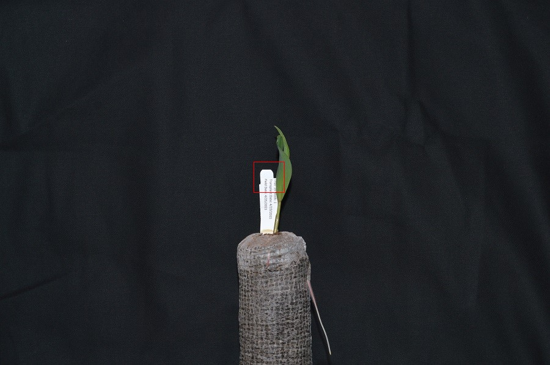

Now, if we zoomed in close enough to see the pixels in the red box,
we would see something like this:

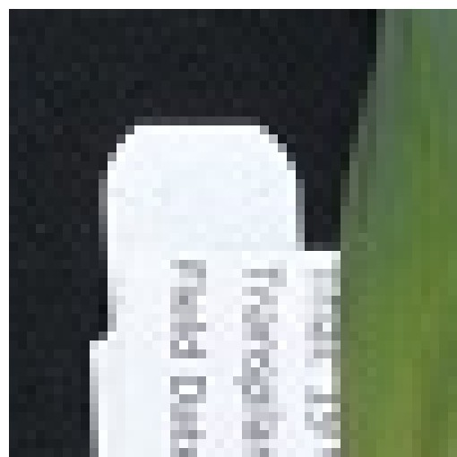

Note that each square in the enlarged image area - each pixel -
is all one colour,
but that each pixel can have a different colour from its neighbors.
Viewed from a distance,
these pixels seem to blend together to form the image we see.

## Working with Pixels
As noted, in practice,
real world images will typically be made up of a vast number of pixels,
and each of these pixels will be one of potentially millions of colours.
While we will deal with pictures of such complexity shortly,
let's start our exploration with 15 pixels in a 5 X 3 matrix with 2 colours and
work our way up to that complexity.

> ## Matrices, arrays, images and pixels
> The **matrix** is mathematical concept - numbers evenly arranged in a rectangle. This can be a two dimensional rectangle, 
> like the shape of the screen you're looking at now. Or it could be a three dimensional equivalent, a cuboid, or have 
> even more dimensions, but always keeping the evenly spaced arrangement of numbers. In computing, **array** refers 
> to a structure in the computer's memory where data is stored in evenly-spaced **elements**. This is strongly analogous 
> to a matrix. A `numpy` array is a **type** of variable (a simpler example of a type is an integer). For our purposes, 
> the distinction between matrices and arrays is not important, we don't really care how the computer arranges our data 
> in its memory. The important thing is that the computer stores values describing the pixels in images, as arrays. And 
> the terms matrix and array can be used interchangeably.
{: .callout}

First, the necessary imports:

~~~
"""
 * Python libraries for learning and performing image processing.
 *
"""
import numpy as np
import matplotlib.pyplot as plt
import ipympl
import imageio.v3 as iio
import skimage
~~~
{: .language-python}

> ## Import Statements in Python
>
> In Python, the `import` statement is used to
> load additional functionality into a program.
> This is necessary when we want our code to do something more specialised,
> which cannot easily be achieved with the limited set of basic tools and
> data structures available in the default Python environment.
>
> Additional functionality can be loaded as a single function or object,
> a module defining several of these, or a library containing many modules.
> You will encounter several different forms of `import` statement.
>
>
> ~~~
> import skimage                 # form 1, load whole skimage library
> import skimage.draw            # form 2, load skimage.draw module only
> from skimage.draw import disk  # form 3, load only the disk function
> import numpy as np             # form 4, load all of numpy into an object called np
> ~~~
> {: .language-python }
>
> > ## Further Explanation
> >
> > In the example above, form 1 loads the entire `skimage` library into the
> > program as an object.
> > Individual modules of the library are then available within that object,
> > e.g., to access the `disk` function used in [the drawing episode]({{ page.root }}),
> > you would write `skimage.draw.disk()`.
> >
> > Form 2 loads only the `draw` module of `skimage` into the program.
> > When we run the code,
> > the program will take less time and use less memory
> > because we will not load the whole `skimage` library.
> > The syntax needed to use the module remains unchanged:
> > to access the `disk` function,
> > we would use the same function call as given for form 1.
> >
> > To further reduce the time and memory requirements for your program,
> > form 3 can be used to import only a specific function/class from a library/module.
> > Unlike the other forms, when this approach is used,
> > the imported function or class can be called by its name only,
> > without prefixing it with the name of the module/library from which it was loaded,
> > i.e., `disk()` instead of `skimage.draw.disk()` using the example above.
> > One hazard of this form is that importing like this will overwrite any
> > object with the same name that was defined/imported earlier in the program,
> > i.e., the example above would replace any existing object called `disk`
> > with the `disk` function from `skimage.draw`.
> >
> > Finally, the `as` keyword can be used when importing,
> > to define a name to be used as shorthand for the library/module being imported.
> > This name is referred to as an alias. Typically, using an alias (such as
> > `np` for the NumPy library) saves us a little typing.
> > You may see `as` combined with any of the other first three forms of `import` statement.
> >
> > Which form is used often depends on
> > the size and number of additional tools being loaded into the program.
> >
> {: .solution }
{: .callout }

Now that we have our libraries loaded,
we will run a Jupyter Magic Command that will ensure our images display
in our Jupyter document with pixel information that will help us
more efficiently run commands later in the session.

~~~
%matplotlib widget
~~~
{: .language-python}

With that taken care of,
let's load our image data from disk using
the `imread` function from the `imageio.v3` module and display it using
the `imshow` function from the `matplotlib.pyplot` module.
`imageio` is a Python library for reading and writing image data.
`imageio.v3` is specifying that we want to use version 3 of `imageio`. This
version has the benefit of supporting nD (multidimensional) image data
natively (think of volumes, movies).

> ## Why not use `skimage.io.imread()`
>
> The `skimage` library has its own function to read an image,
> so you might be asking why we don't use it here.
> Actually, `skimage.io.imread()` uses `iio.imread()` internally when loading an image into Python.
> It is certainly something you may use as you see fit in your own code.
> In this lesson, we use the `imageio` library to read or write (save) images,
> while `skimage` is dedicated to performing operations on the images.
> Using `imageio` gives us more flexibility, especially when it comes to
> handling metadata.
>
{: .callout}

~~~
image = iio.imread(uri="data/eight.tif")
plt.imshow(image)
~~~
{: .language-python}

You might be thinking,
"That does look vaguely like an eight,
and I see two colours but how can that be only 15 pixels".
The display of the eight you see does use a lot more screen pixels to
display our eight so large, but that does not mean there is information
for all those screen pixels in the file.
All those extra pixels are a consequence of our viewer creating
additional pixels through interpolation.
It could have just displayed it as a tiny image using only 15 screen pixels if
the viewer was designed differently.

While many image file formats contain descriptive metadata that can be essential,
the bulk of a picture file is just arrays of numeric information that,
when interpreted according to a certain rule set,
become recognizable as an image to us.
Our image of an eight is no exception,
and `imageio.v3` stored that image data in an array of arrays making
a 5 x 3 matrix of 15 pixels.
We can demonstrate that by calling on the shape property of our image variable
and see the matrix by printing our image variable to the screen.

~~~
print(image.shape)
print(image)
~~~
{: .language-python}

~~~
(5, 3)
[[0. 0. 0.]
 [0. 1. 0.]
 [0. 0. 0.]
 [0. 1. 0.]
 [0. 0. 0.]]
~~~
{: .output }

Thus if we have tools that will allow us to manipulate these arrays of numbers,
we can manipulate the image.
The `numpy` library can be particularly useful here,
so let's try that out using `numpy` array slicing.
Notice that the default behavior of the `imshow` function appended row and
column numbers that will be helpful to us as we try to address individual or
groups of pixels.
First let's load another copy of our eight, and then make it look like a zero.

To make it look like a zero,
we need to change the number underlying the centremost pixel to be 1.
With the help of those row and column headers,
at this small scale we can determine the centre pixel is in row labeled 2 and
column labeled 1.
Using array slicing, we can then address and assign a new value to that position.

~~~
zero = iio.imread(uri="data/eight.tif")
zero[2,1]= 1.0
"""
The follwing line of code creates a new figure for imshow to use in displaying our output. Without it, plt.imshow() would overwrite our previous image in the cell above
"""
fig, ax = plt.subplots()
plt.imshow(zero)
print(zero)
~~~
{: .language-python}

~~~
[[0. 0. 0.]
 [0. 1. 0.]
 [0. 1. 0.]
 [0. 1. 0.]
 [0. 0. 0.]]
~~~
{: .output }

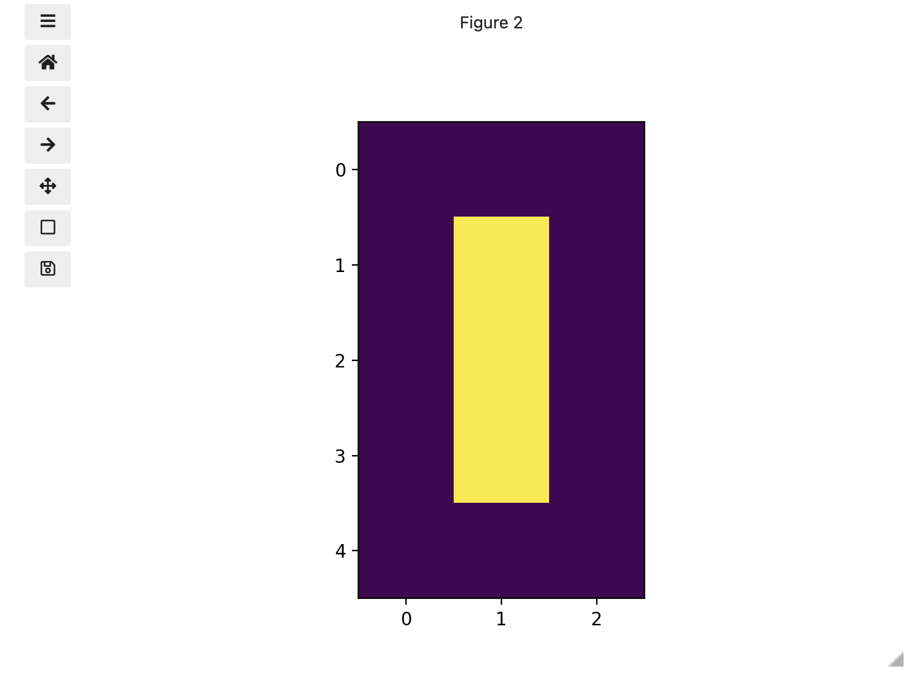

>## Coordinate system
>
> When we process images, we can access, examine, and / or change
> the colour of any pixel we wish.
> To do this, we need some convention on how to access pixels
> individually; a way to give each one a name, or an address of a sort.
>
> The most common manner to do this, and the one we will use in our programs,
> is to assign a modified Cartesian coordinate system to the image.
> The coordinate system we usually see in mathematics has
> a horizontal x-axis and a vertical y-axis, like this:
>
> 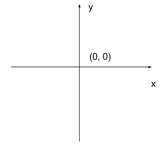
>
> The modified coordinate system used for our images will have only positive
> coordinates, the origin will be in the upper left corner instead of the
> centre, and y coordinate values will get larger as they go down instead of up,
> like this:
>
> 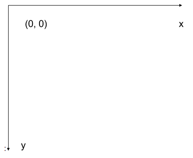
>
> This is called a *left-hand coordinate system*.
> If you hold your left hand in front of your face and point your thumb at the floor,
> your extended index finger will correspond to the x-axis
> while your thumb represents the y-axis.
>
> 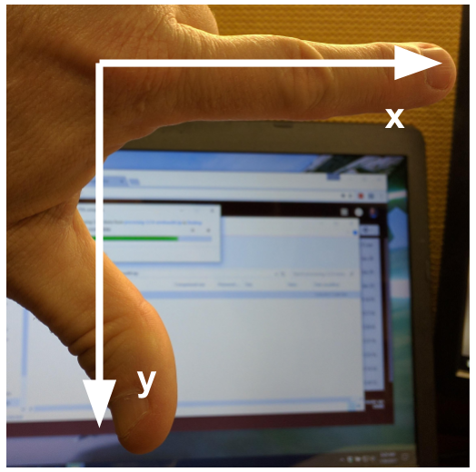
>
> Until you have worked with images for a while,
> the most common mistake that you will make with coordinates is to forget
> that y coordinates get larger as they go down instead of up
> as in a normal Cartesian coordinate system. Consequently, it may be helpful to think
> in terms of counting down rows (r) for the y-axis and across columns (c) for the x-axis. This
> can be especially helpful in cases where you need to transpose image viewer data
> provided in *x,y* format to *y,x* format.  Thus, we will use *cx* and *ry* where appropriate
> to help bridge these two approaches.
{: .callout }

> ## Changing Pixel Values (5 min)
>
> Load another copy of eight named five,
> and then change the value of pixels so you have what looks like a 5 instead of an 8.
> Display the image and print out the matrix as well.
>
> > ## Solution
> > There are many possible solutions, but one method would be . . .
> >
> > ~~~
> > five = iio.imread(uri="data/eight.tif")
> > five[1,2]= 1.0
> > five[3,0]= 1.0
> > fig, ax = plt.subplots()
> > plt.imshow(five)
> > print(five)
> > ~~~
> > {: .language-python}
> >
> > ~~~
> > [[0. 0. 0.]
> >  [0. 1. 1.]
> >  [0. 0. 0.]
> >  [1. 1. 0.]
> >  [0. 0. 0.]]
> > ~~~
> > {: .output }
> >
> > 
> {: .solution}
{: .challenge}

## More colours

Up to now, we only had a 2 colour matrix,
but we can have more if we use other numbers or fractions.
One common way is to use the numbers between 0 and 255 to allow for
256 different colours or 256 different levels of grey.
Let's try that out.

~~~
# make a copy of eight
three_colours = iio.imread(uri="data/eight.tif")

# multiply the whole matrix by 128
three_colours = three_colours * 128

# set the middle row (index 2) to the value of 255.,
# so you end up with the values 0., 128., and 255.
three_colours[2,:] = 255.
fig, ax = plt.subplots()
plt.imshow(three_colours)
print(three_colours)
~~~
{: .language-python}

We now have 3 colours, but are they the three colours you expected?
They all appear to be on a continuum of dark purple on the low end and
yellow on the high end.
This is a consequence of the default colour map (cmap) in this library.
You can think of a colour map as an association or mapping of numbers
to a specific colour.
However, the goal here is not to have one number for every possible colour,
but rather to have a continuum of colours that demonstrate relative intensity.
In our specific case here for example,
255 or the highest intensity is mapped to yellow,
and 0 or the lowest intensity is mapped to a dark purple.
The best colour map for your data will vary and there are many options built in,
but this default selection was not arbitrary.
A lot of science went into making this the default due to its robustness
when it comes to how the human mind interprets relative colour values,
grey-scale printability,
and colour-blind friendliness
(You can read more about this default colour map in
[a Matplotlib tutorial](https://matplotlib.org/stable/tutorials/colors/colormaps.html)
and [an explanatory article by the authors](https://bids.github.io/colormap/)).
Thus it is a good place to start,
and you should change it only with purpose and forethought.
For now, let's see how you can do that using an alternative map
you have likely seen before where it will be even easier to see it as
a mapped continuum of intensities: greyscale.

~~~
fig, ax = plt.subplots()
plt.imshow(three_colours,cmap=plt.cm.gray)
~~~
{: .language-python}

Above we have exactly the same underying data matrix, but in greyscale.
Zero maps to black, 255 maps to white, and 128 maps to medium grey.
Here we only have a single channel in the data and utilize a grayscale color map
to represent the luminance, or intensity of the data and correspondingly
this channel is referred to as the luminance channel.

## Even More Colours

This is all well and good at this scale,
but what happens when we instead have a picture of a natural landscape that
contains millions of colours.
Having a one to one mapping of number to colour like this would be inefficient
and make adjustments and building tools to do so very difficult.
Rather than larger numbers, the solution is to have more numbers in more dimensions.
Storing the numbers in a multi-dimensional matrix where each colour or
property like transparency is associated with its own dimension allows
for individual contributions to a pixel to be adjusted independently.
This ability to manipulate properties of groups of pixels separately will be
key to certain techniques explored in later chapters of this lesson.
To get started let's see an example of how different dimensions of information
combine to produce a set of pixels using a 4 X 4 matrix with 3 dimensions
for the colours red, green, and blue.
Rather than loading it from a file, we will generate this example using numpy.

~~~
# set the random seed so we all get the same matrix
pseudorandomizer = np.random.RandomState(2021)
# create a 4 × 4 checkerboard of random colours
checkerboard = pseudorandomizer.randint(0, 255, size=(4, 4, 3))
# restore the default map as you show the image
fig, ax = plt.subplots()
plt.imshow(checkerboard)
# display the arrays
print(checkerboard)
~~~
{: .language-python}

~~~
[[[116  85  57]
  [128 109  94]
  [214  44  62]
  [219 157  21]]

 [[ 93 152 140]
  [246 198 102]
  [ 70  33 101]
  [  7   1 110]]

 [[225 124 229]
  [154 194 176]
  [227  63  49]
  [144 178  54]]

 [[123 180  93]
  [120   5  49]
  [166 234 142]
  [ 71  85  70]]]
  ~~~
{: .output }

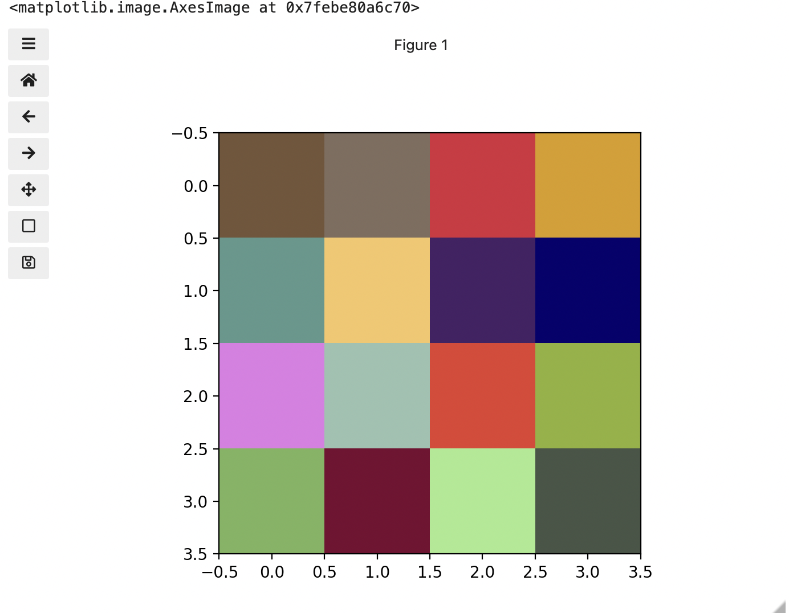

Previously we had one number being mapped to one colour or intensity.
Now we are combining the effect of 3 numbers to arrive at a single colour value.
Let's see an example of that using the blue square at the end of the second row,
which has the index [1, 3].

~~~
# extract all the colour information for the blue square
upper_right_square = checkerboard[1, 3, :]
upper_right_square
~~~
{: .language-python}

This outputs: array([  7,   1, 110])
The integers in order represent Red, Green, and Blue.
Looking at the 3 values and knowing how they map,
can help us understand why it is blue.
If we divide each value by 255, which is the maximum,
we can determine how much it is contributing relative to its maximum potential.
Effectively, the red is at 7/255 or 2.8 percent of its potential,
the green is at 1/255 or 0.4 percent,
and blue is 110/255 or 43.1 percent of its potential.
So when you mix those three intensities of colour,
blue is winning by a wide margin,
but the red and green still contribute to make it a slightly different
shade of blue than 0,0,110 would be on its own.

These colours mapped to dimensions of the matrix may be referred to as channels.
It may be helpful to display each of these channels independently,
to help us understand what is happening.
We can do that by multiplying our image array representation with
a 1d matrix that has a one for the channel we want to keep and zeros for the rest.

~~~
red_channel = checkerboard * [1, 0, 0]
fig, ax = plt.subplots()
plt.imshow(red_channel)
~~~
{: .language-python}

~~~
green_channel = checkerboard * [0, 1, 0]
fig, ax = plt.subplots()
plt.imshow(green_channel)
~~~
{: .language-python}

~~~
blue_channel = checkerboard * [0, 0, 1]
fig, ax = plt.subplots()
plt.imshow(blue_channel)
~~~
{: .language-python}

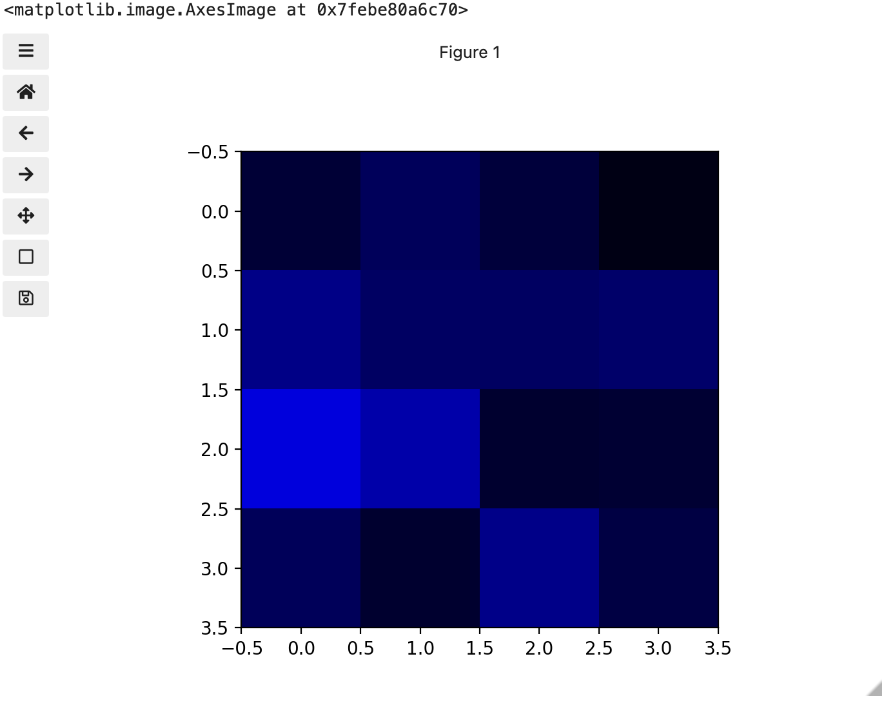

If we look at the upper [1, 3] square in all three figures,
we can see each of those colour contributions in action.
Notice that there are several squares in the blue figure that look
even more intensely blue than square [1, 3].
When all three channels are combined though,
the blue light of those squares is being diluted by the relative strength
of red and green being mixed in with them.

## 24-bit RGB Colour

This last colour model we used,
known as the *RGB (Red, Green, Blue)* model, is the most common.

As we saw, the RGB model is an *additive* colour model, which means that the primary
colours are mixed together to form other colours.
Most frequently, the amount of the primary colour added is represented as
an integer in the closed range [0, 255] as seen in the example.
Therefore, there are 256 discrete amounts of each primary colour that can be
added to produce another colour.
The number of discrete amounts of each colour, 256, corresponds to the number of
bits used to hold the colour channel value, which is eight (28=256).
Since we have three channels with 8 bits for each (8+8+8=24),
this is called 24-bit colour depth.

Any particular colour in the RGB model can be expressed by a triplet of
integers in [0, 255], representing the red, green, and blue channels,
respectively.
A larger number in a channel means that more of that primary colour is present.

> ## Thinking about RGB colours (5 min)
>
> Suppose that we represent colours as triples (r, g, b), where each of r, g,
> and b is an integer in [0, 255].
> What colours are represented by each of these triples?
> (Try to answer these questions without reading further.)
>
> 1. (255, 0, 0)
> 2. (0, 255, 0)
> 3. (0, 0, 255)
> 4. (255, 255, 255)
> 5. (0, 0, 0)
> 6. (128, 128, 128)
>
> > ## Solution
> >
> > 1. (255, 0, 0) represents red, because the red channel is maximised, while
> > 	the other two channels have the minimum values.
> > 2. (0, 255, 0) represents green.
> > 3. (0, 0, 255) represents blue.
> > 4. (255, 255, 255) is a little harder. When we mix the maximum value of all
> > 	three colour channels, we see the colour white.
> > 5. (0, 0, 0) represents the absence of all colour, or black.
> > 6. (128, 128, 128) represents a medium shade of gray.
> >   Note that the 24-bit RGB colour model provides at least 254 shades of gray,
> >   rather than only fifty.
> >
> > Note that the RGB colour model may run contrary to your experience,
> > especially if you have mixed primary colours of paint to create new colours.
> > In the RGB model, the *lack of* any colour is black,
> > while the *maximum amount* of each of the primary colours is white.
> > With physical paint, we might start with a white base,
> > and then add differing amounts of other paints to produce a darker shade.
> >
> {: .solution}
{: .challenge}

After completing the previous challenge,
we can look at some further examples of 24-bit RGB colours, in a visual way.
The image in the next challenge shows some colour names,
their 24-bit RGB triplet values, and the colour itself.

> ## RGB colour table (optional, not included in timing)
>
> 
>
> We cannot really provide a complete table.
> To see why, answer this question:
> How many possible colours can be represented with the 24-bit RGB model?
>
> > ## Solution
> >
> > There are 24 total bits in an RGB colour of this type,
> > and each bit can be on or off,
> > and so there are 224 = 16,777,216
> > possible colours with our additive, 24-bit RGB colour model.
> >
> {: .solution}
{: .challenge}

Although 24-bit colour depth is common, there are other options.
We might have 8-bit colour
(3 bits for red and green, but only 2 for blue, providing 8 × 8 × 4 = 256 colours)
or 16-bit colour
(4 bits for red, green, and blue, plus 4 more for transparency,
providing 16 × 16 × 16 = 4096 colours), for example.
There are colour depths with more than eight bits per channel,
but as the human eye can only discern approximately 10 million different colours,
these are not often used.

If you are using an older or inexpensive laptop screen or LCD monitor to view images,
it may only support 18-bit colour, capable of displaying
64 × 64 × 64 = 262,144 colours.
24-bit colour images will be converted in some manner to 18-bit,
and thus the colour quality you see will not match what is actually in the image.

We can combine our coordinate system with the 24-bit RGB colour model to gain a
conceptual understanding of the images we will be working with.
An image is a rectangular array of pixels,
each with its own coordinate.
Each pixel in the image is a square point of coloured light,
where the colour is specified by a 24-bit RGB triplet.
Such an image is an example of *raster graphics*.

## Image formats

Although the images we will manipulate in our programs are conceptualised as
rectangular arrays of RGB triplets,
they are not necessarily created, stored, or transmitted in that format.
There are several image formats we might encounter,
and we should know the basics of at least of few of them.
Some formats we might encounter, and their file extensions, are shown in this table:

| Format                                  | Extension     |
| :-------------------------------------- | :------------ |
| Device-Independent Bitmap (BMP)         | .bmp          |
| Joint Photographic Experts Group (JPEG) | .jpg or .jpeg |
| Tagged Image File Format (TIFF)         | .tif or .tiff |

## BMP

The file format that comes closest to our preceding conceptualisation of images
is the Device-Independent Bitmap, or BMP, file format.
BMP files store raster graphics images as long sequences of binary-encoded numbers
that specify the colour of each pixel in the image.
Since computer files are one-dimensional structures,
the pixel colours are stored one row at a time.
That is, the first row of pixels (those with y-coordinate 0) are stored first,
followed by the second row (those with y-coordinate 1), and so on.
Depending on how it was created,
a BMP image might have 8-bit, 16-bit, or 24-bit colour depth.

24-bit BMP images have a relatively simple file format,
can be viewed and loaded across a wide variety of operating systems,
and have high quality.
However, BMP images are not *compressed*,
resulting in very large file sizes for any useful image resolutions.

The idea of image compression is important to us for two reasons:
first, compressed images have smaller file sizes,
and are therefore easier to store and transmit;
and second,
compressed images may not have as much detail as their uncompressed counterparts,
and so our programs may not be able to detect some important aspect
if we are working with compressed images.
Since compression is important to us,
we should take a brief detour and discuss the concept.

## Image compression

Before discussing additional formats,
familiarity with image compression will be helpful.
Let's delve into that subject with a challenge.
For this challenge,
you will need to know about bits / bytes and
how those are used to express computer storage capacities.
If you already know, you can skip to the challenge below.

>## Bits and bytes
>
> Before we talk specifically about images,
> we first need to understand how numbers are stored in a modern digital computer.
> When we think of a number,
> we do so using a *decimal*, or *base-10* place-value number system.
> For example, a number like 659 is
> 6 × 102 + 5 × 101 + 9 × 100.
> Each digit in the number is multiplied by a power of 10,
> based on where it occurs,
> and there are 10 digits that can occur in each position
> (0, 1, 2, 3, 4, 5, 6, 7, 8, 9).
>
> In principle,
> computers could be constructed to represent numbers in exactly the same way.
> But, the electronic circuits inside a computer are much easier to construct
> if we restrict the numeric base to only two, instead of 10.
> (It is easier for circuitry to tell the difference between
> two voltage levels than it is to differentiate among 10 levels.)
> So, values in a computer are stored using a *binary*,
> or *base-2* place-value number system.
>
> In this system, each symbol in a number is called a *bit* instead of a digit,
> and there are only two values for each bit (0 and 1).
> We might imagine a four-bit binary number, 1101.
> Using the same kind of place-value expansion as we did above for 659,
> we see that
> 1101 = 1 × 23 + 1 × 22 + 0 × 21 + 1 × 20,
> which if we do the math is 8 + 4 + 0 + 1, or 13 in decimal.
>
> Internally,
> computers have a minimum number of bits that they work with at a given time: eight.
> A group of eight bits is called a *byte*.
> The amount of memory (RAM) and drive space our computers have is quantified
> by terms like Megabytes (MB), Gigabytes (GB), and Terabytes (TB).
> The following table provides more formal definitions for these terms.
>
> | Unit     | Abbreviation | Size       |
> | :------- | ------------ | :--------- |
> | Kilobyte | KB           | 1024 bytes |
> | Megabyte | MB           | 1024 KB    |
> | Gigabyte | GB           | 1024 MB    |
> | Terabyte | TB           | 1024 GB    |
{: .callout }

> ## BMP image size (optional, not included in timing)
>
> Imagine that we have a fairly large, but very boring image:
> a 5,000 × 5,000 pixel image composed of nothing but white pixels.
> If we used an uncompressed image format such as BMP,
> with the 24-bit RGB colour model,
> how much storage would be required for the file?
>
> > ## Solution
> > In such an image, there are 5,000 × 5,000 = 25,000,000 pixels,
> > and 24 bits for each pixel,
> > leading to 25,000,000 × 24 = 600,000,000 bits,
> > or 75,000,000 bytes (71.5MB).
> > That is quite a lot of space for a very uninteresting image!
> >
> {: .solution}
{: .challenge}

Since image files can be very large,
various *compression* schemes exist for saving
(approximately) the same information while using less space.
These compression techniques can be categorised as *lossless* or *lossy*.

### Lossless compression

In lossless image compression,
we apply some algorithm (i.e., a computerised procedure) to the image,
resulting in a file that is significantly smaller than
the uncompressed BMP file equivalent would be.
Then, when we wish to load and view or process the image,
our program reads the compressed file, and reverses the compression process,
resulting in an image that is *identical* to the original.
Nothing is lost in the process -- hence the term "lossless."

The general idea of lossless compression is to somehow detect
long patterns of bytes in a file that are repeated over and over,
and then assign a smaller bit pattern to represent the longer sample.
Then, the compressed file is made up of the smaller patterns,
rather than the larger ones,
thus reducing the number of bytes required to save the file.
The compressed file also contains
a table of the substituted patterns and the originals,
so when the file is decompressed it can be
made identical to the original before compression.

To provide you with a concrete example,
consider the 71.5 MB white BMP image discussed above.
When put through the zip compression utility on Microsoft Windows,
the resulting .zip file is only 72 KB in size!
That is, the .zip version of the image is
three orders of magnitude smaller than the original,
and it can be decompressed into a file that is
byte-for-byte the same as the original.
Since the original is so repetitious -
simply the same colour triplet repeated 25,000,000 times -
the compression algorithm can dramatically reduce the size of the file.

If you work with .zip or .gz archives, you are dealing with lossless
compression.

### Lossy compression

Lossy compression takes the original image and discards some of the detail in it,
resulting in a smaller file format.
The goal is to only throw away detail that someone viewing the image would not notice.
Many lossy compression schemes have adjustable levels of compression,
so that the image creator can choose the amount of detail that is lost.
The more detail that is sacrificed,
the smaller the image files will be -
but of course, the detail and richness of the image will be lower as well.

This is probably fine for images that are shown on Web pages
or printed off on 4 × 6 photo paper,
but may or may not be fine for scientific work.
You will have to decide whether the loss of image quality and detail are
important to your work,
versus the space savings afforded by a lossy compression format.

It is important to understand that
once an image is saved in a lossy compression format,
the lost detail is just that - lost.
I.e., unlike lossless formats,
given an image saved in a lossy format,
there is no way to reconstruct the original image in a byte-by-byte manner.

## JPEG

JPEG images are perhaps the most commonly encountered digital images today.
JPEG uses lossy compression,
and the degree of compression can be tuned to your liking.
It supports 24-bit colour depth,
and since the format is so widely used,
JPEG images can be viewed and manipulated easily on all computing platforms.

> ## Examining actual image sizes (optional, not included in timing)
>
> Let us see the effects of image compression on image size with actual images.
> The following script creates a square white image 5000 X 5000 pixels,
> and then saves it as a BMP and as a JPEG image.
>
> ~~~
> import imageio.v3 as iio
> import numpy as np
>
> dim = 5000
>
> img = np.zeros((dim, dim, 3), dtype="uint8")
> img.fill(255)
>
> iio.imwrite(uri="data/ws.bmp", image=img)
> iio.imwrite(uri="data/ws.jpg", image=img)
> ~~~
> {: .language-python}
>
> Examine the file sizes of the two output files, `ws.bmp` and `ws.jpg`.
> Does the BMP image size match our previous prediction?
> How about the JPEG?
>
> > ## Solution
> >
> > The BMP file, `ws.bmp`, is 75,000,054 bytes,
> > which matches our prediction very nicely.
> > The JPEG file, `ws.jpg`, is 392,503 bytes,
> > two orders of magnitude smaller than the bitmap version.
> >
> {: .solution}
{: .challenge}

> ## Comparing lossless versus lossy compression (optional, not included in timing)
>
> Let us see a hands-on example of lossless versus lossy compression.
> Once again, open a terminal and navigate to the `data/` directory.
> The two output images, `ws.bmp` and `ws.jpg`, should still be in the directory,
> along with another image, `tree.jpg`.
>
> We can apply lossless compression to any file by using the `zip` command.
> Recall that the `ws.bmp` file contains 75,000,054 bytes.
> Apply lossless compression to this image by executing the following command:
> `zip ws.zip ws.bmp`.
> This command tells the computer to create a new compressed file,
> `ws.zip`, from the original bitmap image.
> Execute a similar command on the tree JPEG file: `zip tree.zip tree.jpg`.
>
> Having created the compressed file,
> use the `ls -al` command to display the contents of the directory.
> How big are the compressed files?
> How do those compare to the size of `ws.bmp` and `tree.jpg`?
> What can you conclude from the relative sizes?
>
> > ## Solution
> >
> > Here is a partial directory listing, showing the sizes of the relevant files there:
> >
> > ~~~
> > -rw-rw-r--  1 diva diva   154344 Jun 18 08:32 tree.jpg
> > -rw-rw-r--  1 diva diva   146049 Jun 18 08:53 tree.zip
> > -rw-rw-r--  1 diva diva 75000054 Jun 18 08:51 ws.bmp
> > -rw-rw-r--  1 diva diva    72986 Jun 18 08:53 ws.zip
> > ~~~
> > {: .output}
> >
> > We can see that the regularity of the bitmap image
> > (remember, it is a 5,000 x 5,000 pixel image containing only white pixels)
> > allows the lossless compression scheme to compress the file quite effectively.
> > On the other hand, compressing `tree.jpg` does not create a much smaller file;
> > this is because the JPEG image was already in a compressed format.
> >
> {: .solution}
{: .challenge}

Here is an example showing how JPEG compression might impact image quality.
Consider this image of several maize seedlings
(scaled down here from 11,339 × 11,336 pixels in order to fit the display).

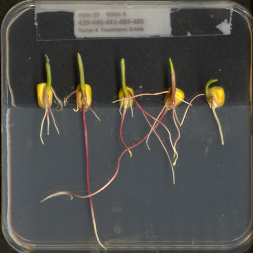

Now, let us zoom in and look at a small section of the label in the original,
first in the uncompressed format:

Here is the same area of the image, but in JPEG format.
We used a fairly aggressive compression parameter to make the JPEG,
in order to illustrate the problems you might encounter with the format.

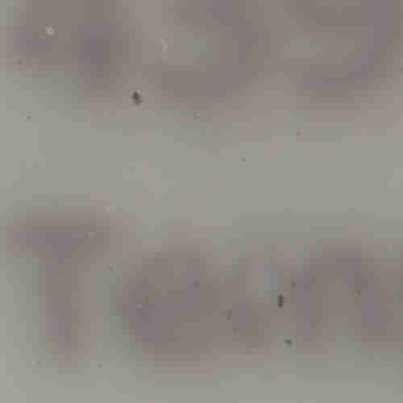

The JPEG image is of clearly inferior quality.
It has less colour variation and noticeable pixelation.
Quality differences become even more marked when one examines
the colour histograms for each image.
A histogram shows how often each colour value appears in an image.
The histograms for the uncompressed (left) and compressed (right) images
are shown below:

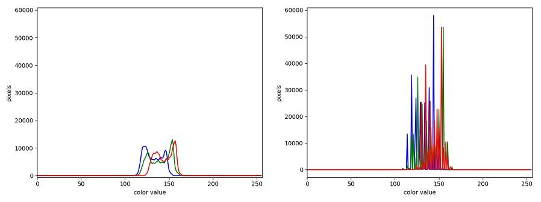

We learn how to make histograms such as these later on in the workshop.
The differences in the colour histograms are even more apparent than in the
images themselves;
clearly the colours in the JPEG image are different from the uncompressed version.

If the quality settings for your JPEG images are high
(and the compression rate therefore relatively low),
the images may be of sufficient quality for your work.
It all depends on how much quality you need,
and what restrictions you have on image storage space.
Another consideration may be *where* the images are stored.
For example,if your images are stored in the cloud and therefore
must be downloaded to your system before you use them,
you may wish to use a compressed image format to speed up file transfer time.

## PNG

PNG images are well suited for storing diagrams. It uses a lossless compression and is hence often used 
in web applications for non-photographic images. The format is able to store RGB and plain luminance (single channel, without an associated color) data, among others. Image data is stored row-wise and then, per row, a simple filter, like taking the difference of adjacent pixels, can be applied to
increase the compressability of the data. The filtered data is then compressed in the next step and written out to the disk.

## TIFF

TIFF images are popular with publishers, graphics designers, and photographers.
TIFF images can be uncompressed,
or compressed using either lossless or lossy compression schemes,
depending on the settings used,
and so TIFF images seem to have the benefits of both the BMP and JPEG formats.
The main disadvantage of TIFF images
(other than the size of images in the uncompressed version of the format)
is that they are not universally readable by image viewing and manipulation software.

## Metadata

JPEG and TIFF images support the inclusion of *metadata* in images.
Metadata is textual information that is contained within an image file.
Metadata holds information about the image itself,
such as when the image was captured,
where it was captured,
what type of camera was used and with what settings, etc.
We normally don't see this metadata when we view an image,
but we can view it independently if we wish to
(see [_Accessing Metadata_](#viewing-metadata), below).
The important thing to be aware of at this stage is that
you cannot rely on the metadata of an image being fully preserved
when you use software to process that image.
The image reader/writer library that we use throughout this lesson,
`imageio.v3`, includes metadata when saving new images but may fail to keep
certain metadata fields.
In any case, remember: **if metadata is important to you,
take precautions to always preserve the original files**.

> ## Accessing Metadata
>
> `imageio.v3` provides a way to display or explore the metadata
> associated with an image. Metadata is served independently from pixel data:
>
> ~~~
> # read metadata
> metadata = iio.immeta(uri="data/eight.tif")
> # display the format-specific metadata
> metadata
> ~~~
> {: .language-python}
>
> ~~~
> {'is_fluoview': False,
>  'is_nih': False,
>  'is_micromanager': False,
>  'is_ome': False,
>  'is_lsm': False,
>  'is_reduced': False,
>  'is_shaped': True,
>  'is_stk': False,
>  'is_tiled': False,
>  'is_mdgel': False,
>  'compression': <COMPRESSION.NONE: 1>,
>  'predictor': 1,
>  'is_mediacy': False,
>  'description': '{"shape": [5, 3]}',
>  'description1': '',
>  'is_imagej': False,
>  'software': 'tifffile.py',
>  'resolution_unit': 1,
>  'resolution': (1.0, 1.0, 'NONE')}
> ~~~
> {: .output }
>
> Other software exists that can help you handle metadata,
> e.g., [Fiji](https://imagej.net/Fiji)
> and [ImageMagick](https://imagemagick.org/index.php).
> You may want to explore these options if you need to work with
> the metadata of your images.
>
{: .callout }

## Summary of image formats used in this lesson

The following table summarises the characteristics of the BMP, JPEG, and TIFF
image formats:

| Format   | Compression   | Metadata   | Advantages            | Disadvantages      |
| :------- | :------------ | :--------- | :-------------------- | :----------------- |
| BMP      | None          | None       | Universally viewable, | Large file sizes   |
|          |               |            | high quality          |                    |
| JPEG     | Lossy         | Yes        | Universally viewable, | Detail may be lost |
|          |               |            | smaller file size     |                    |
| PNG      | Lossless      | [Yes](https://www.w3.org/TR/PNG/#11keywords) | Universally viewable, [open standard](https://www.w3.org/TR/PNG/), smaller file size | Metadata less flexible than TIFF, RGB only |
| TIFF     | None, lossy,  | Yes        | High quality or       | Not universally viewable   |
|          | or lossless   |            | smaller file size     |                    |
