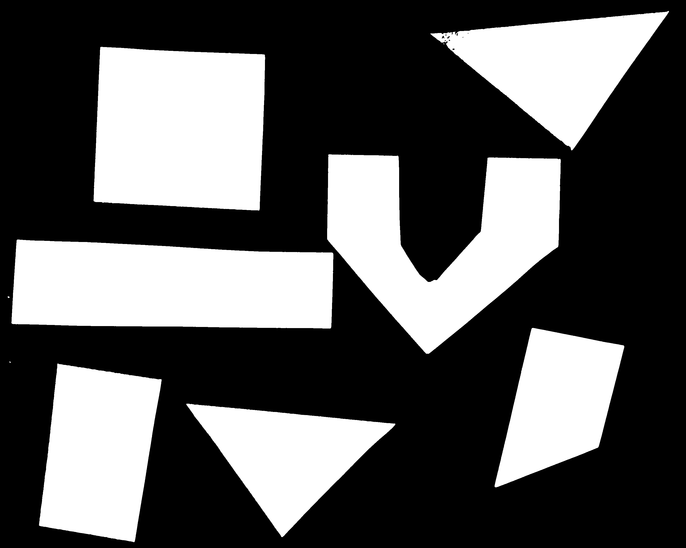
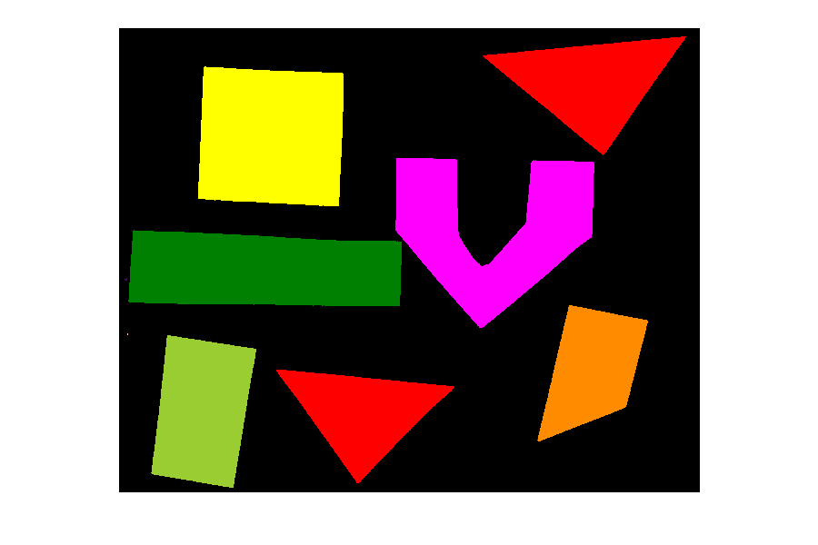
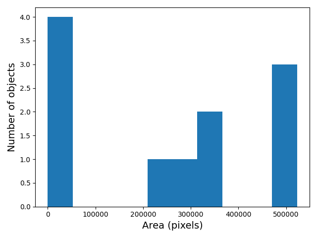
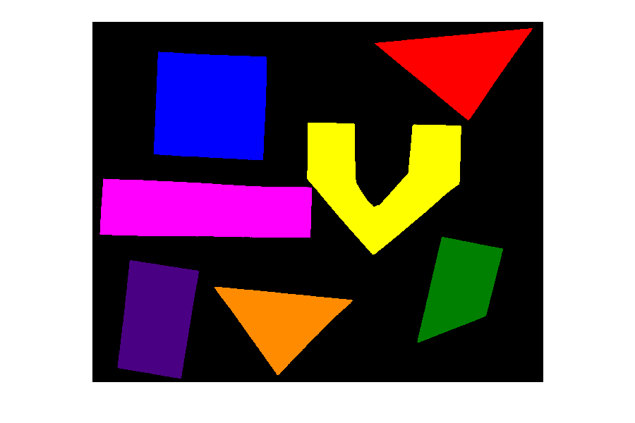
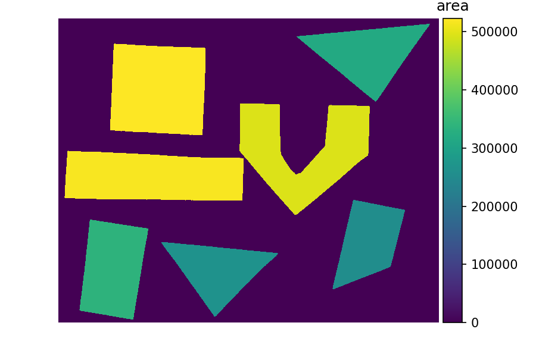

## Objects

In [the _Thresholding_ episode]({{ page.root }})
we have covered dividing an image into foreground and background pixels.
In the shapes example image,
we considered the coloured shapes as foreground _objects_ on a white background.

{: .image-with-shadow}

In thresholding we went from the original image to this version:

Here, we created a mask that only highlights the parts of the image
that we find interesting, the _objects_.
All objects have pixel value of `True` while the background pixels are `False`.

By looking at the mask image,
one can count the objects that are present in the image (7).
But how did we actually do that,
how did we decide which lump of pixels constitutes a single object?

<!-- TODO: Group exercise: given sheep of paper with grids of 0's and
1's, how to identify which pixels belong to an object, find a rule for
each pixel to determine in which object it is -->

## Pixel Neighborhoods

In order to decide which pixels belong to the same object,
one can exploit their neighborhood:
pixels that are directly next to each other
and belong to the foreground class can be considered to belong to the same object.

Let's discuss the concept of pixel neighborhoods in more detail.
Consider the following mask "image" with 8 rows, and 8 columns.
For the purpose of illustration, the digit `0` is used to represent
background pixels, and the letter `X` is used to represent
object pixels foreground).

~~~
0 0 0 0 0 0 0 0
0 X X 0 0 0 0 0
0 X X 0 0 0 0 0
0 0 0 X X X 0 0
0 0 0 X X X X 0
0 0 0 0 0 0 0 0
~~~
{: .output}

The pixels are organised in a rectangular grid.
In order to understand pixel neighborhoods
we will introduce the concept of "jumps" between pixels.
The jumps follow two rules:
First rule is that one jump is only allowed along the column, or the row.
Diagonal jumps are not allowed.
So, from a centre pixel, denoted with `o`,
only the pixels indicated with a `1` are reachable:

~~~
- 1 -
1 o 1
- 1 -
~~~
{: .output}

The pixels on the diagonal (from `o`) are not reachable with a single jump,
which is denoted by the `-`.
The pixels reachable with a single jump form the __1-jump__ neighborhood.

The second rule states that in a sequence of jumps,
one may only jump in row and column direction once -> they have to be _orthogonal_.
An example of a sequence of orthogonal jumps is shown below.
Starting from `o` the first jump goes along the row to the right.
The second jump then goes along the column direction up.
After this,
the sequence cannot be continued as a jump has already been made
in both row and column direction.

~~~
- - 2
- o 1
- - -
~~~
{: .output}

All pixels reachable with one, or two jumps form the __2-jump__ neighborhood.
The grid below illustrates the pixels reachable from
the centre pixel `o` with a single jump, highlighted with a `1`,
and the pixels reachable with 2 jumps with a `2`.

~~~
2 1 2
1 o 1
2 1 2
~~~
{: .output}

We want to revisit our example image mask from above and apply
the two different neighborhood rules.
With a single jump connectivity for each pixel, we get two resulting objects,
highlighted in the image with `A`'s and `B`'s.

~~~
0 0 0 0 0 0 0 0
0 A A 0 0 0 0 0
0 A A 0 0 0 0 0
0 0 0 B B B 0 0
0 0 0 B B B B 0
0 0 0 0 0 0 0 0
~~~
{: .output}

In the 1-jump version,
only pixels that have direct neighbors along rows or columns are considered connected.
Diagonal connections are not included in the 1-jump neighborhood.
With two jumps, however, we only get a single object `A` because pixels are also
considered connected along the diagonals.

~~~
0 0 0 0 0 0 0 0
0 A A 0 0 0 0 0
0 A A 0 0 0 0 0
0 0 0 A A A 0 0
0 0 0 A A A A 0
0 0 0 0 0 0 0 0
~~~
{: .output}

> ## Object counting (optional, not included in timing)
>
> How many objects with 1 orthogonal jump, how many with 2 orthogonal jumps?
>
> ~~~
> 0 0 0 0 0 0 0 0
> 0 X 0 0 0 X X 0
> 0 0 X 0 0 0 0 0
> 0 X 0 X X X 0 0
> 0 X 0 X X 0 0 0
> 0 0 0 0 0 0 0 0
> ~~~
> {: .output}
>
> 1 jump
>
> a) 1
> b) 5
> c) 2
>
> > ## Solution
> > b) 5
> {: .solution}
>
> 2 jumps
>
> a) 2
> b) 3
> c) 5
>
> > ## Solution
> > a) 2
> {: .solution}
{: .challenge}

> ## Jumps and neighborhoods
>
> We have just introduced how you can reach different neighboring
> pixels by performing one or more orthogonal jumps. We have used the
> terms 1-jump and 2-jump neighborhood. There is also a different way
> of referring to these neighborhoods: the 4- and 8-neighborhood.
> With a single jump you can reach four pixels from a given starting
> pixel. Hence, the 1-jump neighborhood corresponds to the
> 4-neighborhood. When two orthogonal jumps are allowed, eight pixels
> can be reached, so the 2-jump neighborhood corresponds to the
> 8-neighborhood.
{: .callout}

## Connected Component Analysis

In order to find the objects in an image, we want to employ an
operation that is called Connected Component Analysis (CCA).
This operation takes a binary image as an input.
Usually, the `False` value in this image is associated with background pixels,
and the `True` value indicates foreground, or object pixels.
Such an image can be produced, e.g., with thresholding.
Given a thresholded image,
the connected component analysis produces a new _labeled_ image with integer pixel values.
Pixels with the same value, belong to the same object.
Skimage provides connected component analysis in the function `skimage.measure.label()`.
Let us add this function to the already familiar steps of thresholding an image.
Here we define a reusable Python function `connected_components`:

~~~
import numpy as np
import matplotlib.pyplot as plt
import skimage.io
import skimage.color
import skimage.filters
import skimage.measure

def connected_components(filename, sigma=1.0, t=0.5, connectivity=2):
    # load the image
    image = skimage.io.imread(filename)
    # convert the image to grayscale
    gray_image = skimage.color.rgb2gray(image)
    # denoise the image with a Gaussian filter
    blurred_image = skimage.filters.gaussian(gray_image, sigma=sigma)
    # mask the image according to threshold
    binary_mask = blurred_image < t
    # perform connected component analysis
    labeled_image, count = skimage.measure.label(binary_mask,
                                                 connectivity=connectivity, return_num=True)
    return labeled_image, count
~~~
{: .language-python}

Note the new import of `skimage.measure` in order to use the
`skimage.measure.label` function that performs the CCA.
The first four lines of code are familiar from
[the _Thresholding_ episode]({{ page.root }}).

<!-- Note: shapes image: with sigma=2.0, threshold=0.9 -> 11 objects; with sigma=5 -> 8 objects -->

Then we call the `skimage.measure.label` function.
This function has one positional argument where we pass the `binary_mask`,
i.e., the binary image to work on.
With the optional argument `connectivity`,
we specify the neighborhood in units of orthogonal jumps.
For example,
by setting `connectivity=2` we will consider the 2-jump neighborhood introduced above.
The function returns a `labeled_image` where each pixel has
a unique value corresponding to the object it belongs to.
In addition, we pass the optional parameter `return_num=True` to return
the maximum label index as `count`.

> ## Optional parameters and return values
>
> The optional parameter `return_num` changes the data type that is
> returned by the function `skimage.measure.label`.
> The number of labels is only returned if `return_num` is _True_.
> Otherwise, the function only returns the labeled image.
> This means that we have to pay attention when assigning
> the return value to a variable.
> If we omit the optional parameter `return_num` or pass `return_num=False`,
> we can call the function as
>
> ~~~
> labeled_image = skimage.measure.label(binary_mask)
> ~~~
> {: .language-python}
>
> If we pass `return_num=True`, the function returns a tuple and we
> can assign it as
>
> ~~~
> labeled_image, count = skimage.measure.label(binary_mask, return_num=True)
> ~~~
> {: .language-python}
>
> If we used the same assignment as in the first case,
> the variable `labeled_image` would become a tuple,
> in which `labeled_image[0]` is the image
> and `labeled_image[1]` is the number of labels.
> This could cause confusion if we assume that `labeled_image`
> only contains the image and pass it to other functions.
> If you get an
> `AttributeError: 'tuple' object has no attribute 'shape'`
> or similar,  check if you have assigned the return values consistently
> with the optional parameters.
{: .callout}

We can call the above function `connected_components` and
display the labeled image like so:

~~~
labeled_image, count = connected_components(filename="data/shapes-01.jpg", sigma=2.0, t=0.9, connectivity=2)

fig, ax = plt.subplots()
plt.imshow(labeled_image)
plt.axis("off");
~~~
{: .language-python}

> ## Color mappings
> 
> Here you might get a warning
> `UserWarning: Low image data range; displaying image with stretched contrast.`
> or just see an all black image
> (Note: this behavior might change in future versions or
> not occur with a different image viewer).
> 
> What went wrong?
> When you hover over the black image,
> the pixel values are shown as numbers in the lower corner of the viewer.
> You can see that some pixels have values different from `0`,
> so they are not actually pure black.
> Let's find out more by examining `labeled_image`.
> Properties that might be interesting in this context are `dtype`,
> the minimum and maximum value.
> We can print them with the following lines:
> 
> ~~~
> print("dtype:", labeled_image.dtype)
> print("min:", np.min(labeled_image))
> print("max:", np.max(labeled_image))
> ~~~
> {: .language-python}
> 
> Examining the output can give us a clue why the image appears black.
> 
> ~~~
> dtype: int32
> min: 0
> max: 11
> ~~~
> {: .output}
> 
> The `dtype` of `labeled_image` is `int64`.
> This means that values in this image range from `-2 ** 63` to `2 ** 63 - 1`.
> Those are really big numbers.
> From this available space we only use the range from `0` to `11`.
> When showing this image in the viewer,
> it squeezes the complete range into 256 gray values.
> Therefore, the range of our numbers does not produce any visible change.
>
> Fortunately, the skimage library has tools to cope with this situation.
{: .solution }

We can use the function `skimage.color.label2rgb()`
to convert the colours in the image
(recall that we already used the `skimage.color.rgb2gray()` function
to convert to grayscale).
With `skimage.color.label2rgb()`,
all objects are coloured according to a list of colours that can be customised.
We can use the following commands to convert and show the image:

~~~
# convert the label image to color image
colored_label_image = skimage.color.label2rgb(labeled_image, bg_label=0)

fig, ax = plt.subplots()
plt.imshow(colored_label_image)
plt.axis("off");
~~~
{: .language-python}

> ## How many objects are in that image (15 min)
>
>
> Now, it is your turn to practice.
> Using the function `connected_components`,
> find two ways of printing out the number of objects found in the image.
>
> What number of objects would you expect to get?
>
> How does changing the `sigma` and `threshold` values influence the result?
>
> > ## Solution
> >
> > As you might have guessed, the return value `count` already
> > contains the number of found images. So it can simply be printed
> > with
> >
> > ~~~
> > print("Found", count, "objects in the image.")
> > ~~~
> > {: .language-python}
> >
> > But there is also a way to obtain the number of found objects from
> > the labeled image itself.
> > Recall that all pixels that belong to a single object
> > are assigned the same integer value.
> > The connected component algorithm produces consecutive numbers.
> > The background gets the value `0`,
> > the first object gets the value `1`,
> > the second object the value `2`, and so on.
> > This means that by finding the object with the maximum value,
> > we also know how many objects there are in the image.
> > We can thus use the `np.max` function from Numpy to
> > find the maximum value that equals the number of found objects:
> >
> > ~~~
> > num_objects = np.max(labeled_image)
> > print("Found", num_objects, "objects in the image.")
> > ~~~
> > {: .language-python}
> >
> > Invoking the function with `sigma=2.0`, and `threshold=0.9`,
> > both methods will print
> >
> > ~~~
> > Found 11 objects in the image.
> > ~~~
> > {: .output}
> >
> > Lowering the threshold will result in fewer objects.
> > The higher the threshold is set, the more objects are found.
> > More and more background noise gets picked up as objects.
> > Larger sigmas produce binary masks with less noise and hence
> > a smaller number of objects.
> > Setting sigma too high bears the danger of merging objects.
> {: .solution}
{: .challenge}

You might wonder why the connected component analysis with `sigma=2.0`,
and `threshold=0.9` finds 11 objects, whereas we would expect only 7 objects.
Where are the four additional objects?
With a bit of detective work, we can spot some small objects in the image,
for example, near the left border.

For us it is clear that these small spots are artifacts and
not objects we are interested in.
But how can we tell the computer?
One way to calibrate the algorithm is to adjust the parameters for
blurring (`sigma`) and thresholding (`t`),
but you may have noticed during the above exercise that
it is quite hard to find a combination that produces the right output number.
In some cases, background noise gets picked up as an object.
And with other parameters,
some of the foreground objects get broken up or disappear completely.
Therefore, we need other criteria to describe desired properties of the objects
that are found.

## Morphometrics - Describe object features with numbers

Morphometrics is concerned with the quantitative analysis of objects and
considers properties such as size and shape.
For the example of the images with the shapes,
our intuition tells us that the objects should be of a certain size or area.
So we could use a minimum area as a criterion for when an object should be detected.
To apply such a criterion,
we need a way to calculate the area of objects found by connected components.
Recall how we determined the root mass in
[the _Thresholding_ episode]({{ page.root }})
by counting the pixels in the binary mask.
But here we want to calculate the area of several objects in the labeled image.
The skimage library provides the function `skimage.measure.regionprops`
to measure the properties of labeled regions.
It returns a list of `RegionProperties` that describe each connected region in the images.
The properties can be accessed using the attributes of the `RegionProperties` data type.
Here we will use the properties `"area"` and `"label"`.
You can explore the skimage documentation to learn about other properties available.

We can get a list of areas of the labeled objects as follows:

~~~
# compute object features and extract object areas
object_features = skimage.measure.regionprops(labeled_image)
object_areas = [objf["area"] for objf in object_features]
object_areas
~~~
{: .language-python}

This will produce the output

~~~
[318542, 1, 523204, 496613, 517331, 143, 256215, 1, 68, 338784, 265755]
~~~
{: .output}

> ## Plot a histogram of the object area distribution (10 min)
>
> Similar to how we determined a "good" threshold in
> [the _Thresholding_ episode]({{ page.root }}),
> it is often helpful to inspect the histogram of an object property.
> For example, we want to look at the distribution of the object areas.
>
> 1. Create and examine a [histogram]({{ page.root }}/05-creating-histograms)
> of the object areas obtained with `skimage.measure.regionprops`.
> 2. What does the histogram tell you about the objects?
>
> > ## Solution
> >
> > The histogram can be plotted with
> > ~~~
> > fig, ax = plt.subplots()
> > plt.hist(object_areas)
> > plt.xlabel("Area (pixels)")
> > plt.ylabel("Number of objects");
> > ~~~
> > {: .language-python}
> >
> > 
> >
> > The histogram shows the number of objects (vertical axis)
> > whose area is within a certain range (horizontal axis).
> > The height of the bars in the histogram indicates
> > the prevalence of objects with a certain area.
> > The whole histogram tells us about the distribution of object sizes in the image.
> > It is often possible to identify gaps between groups of bars
> > (or peaks if we draw the histogram as a continuous curve)
> > that tell us about certain groups in the image.
> >
> > In this example, we can see that there are four small objects that
> > contain less than 50000 pixels.
> > Then there is a group of four (1+1+2) objects in
> > the range between 200000 and 400000,
> > and three objects with a size around 500000.
> > For our object count, we might want to disregard the small objects as artifacts,
> > i.e, we want to ignore the leftmost bar of the histogram.
> > We could use a threshold of 50000 as the minimum area to count.
> > In fact, the `object_areas` list already tells us that
> > there are fewer than 200 pixels in these objects.
> > Therefore, it is reasonable to require a minimum area of at least 200 pixels
> > for a detected object.
> > In practice, finding the "right" threshold can be tricky and
> > usually involves an educated guess based on domain knowledge.
> {: .solution}
{: .challenge}

> ## Filter objects by area (10 min)
>
> Now we would like to use a minimum area criterion to obtain a more
> accurate count of the objects in the image.
>
> 1. Find a way to calculate the number of objects by only counting
>    objects above a certain area.
>
> > ## Solution
> >
> > One way to count only objects above a certain area is to first
> > create a list of those objects, and then take the length of that
> > list as the object count. This can be done as follows:
> >
> > ~~~
> > min_area = 200
> > large_objects = []
> > for objf in object_features:
> >     if objf["area"] > min_area:
> >         large_objects.append(objf["label"])
> > print("Found", len(large_objects), "objects!")
> > ~~~
> > {: .language-python}
> >
> > Another option is to use Numpy arrays to create the list of large objects.
> > We first create an array `object_areas` containing the object areas,
> > and an array `object_labels` containing the object labels.
> > The labels of the objects are also returned by `skimage.measure.regionprops`.
> > We have already seen that we can create boolean arrays using comparison operators.
> > Here we can use `object_areas > min_area`
> > to produce an array that has the same dimension as `object_labels`.
> > It can then used to select the labels of objects whose area is
> > greater than `min_area` by indexing:
> >
> > ~~~
> > object_areas = np.array([objf["area"] for objf in object_features])
> > object_labels = np.array([objf["label"] for objf in object_features])
> > large_objects = object_labels[object_areas > min_area]
> > print("Found", len(large_objects), "objects!")
> > ~~~
> > {: .language-python}
> >
> > The advantage of using Numpy arrays is that
> > `for` loops and `if` statements in Python can be slow,
> > and in practice the first approach may not be feasible
> > if the image contains a large number of objects.
> > In that case, Numpy array functions turn out to be very useful because
> > they are much faster.
> >
> > In this example, we can also use the `np.count_nonzero` function
> > that we have seen earlier together with the `>` operator to count
> > the objects whose area is above `min_area`.
> >
> > ~~~
> > n = np.count_nonzero(object_areas > min_area)
> > print("Found", n, "objects!")
> > ~~~
> > {: .language-python}
> >
> > For all three alternatives, the output is the same and gives the
> > expected count of 7 objects.
> {: .solution}
{: .challenge}

> ## Using functions from Numpy and other Python packages
> Functions from Python packages such as Numpy are often more efficient and
> require less code to write.
> It is a good idea to browse the reference pages of `numpy` and `skimage` to
> look for an availabe function that can solve a given task.
{: .callout}

> ## Remove small objects (20 min)
>
> We might also want to exclude (mask) the small objects when plotting
> the labeled image.
>
> 2. Enhance the `connected_components` function such that
> it automatically removes objects that are below a certain area that is
> passed to the function as an optional parameter.
>
> > ## Solution
> >
> >
> > To remove the small objects from the labeled image,
> > we change the value of all pixels that belong to the small objects to
> > the background label 0.
> > One way to do this is to loop over all objects and
> > set the pixels that match the label of the object to 0.
> >
> > ~~~
> > for object_id, objf in enumerate(object_features, start=1):
> >     if objf["area"] < min_area:
> >         labeled_image[labeled_image == objf["label"]] = 0
> > ~~~
> > {: .language-python}
> >
> > Here Numpy functions can also be used to eliminate
> > `for` loops and `if` statements.
> > Like above, we can create an array of the small object labels with
> > the comparison `object_areas < min_area`.
> > We can use another Numpy function, `np.isin`,
> > to set the pixels of all small objects to 0.
> > `np.isin` takes two arrays and returns a boolean array with values
> > `True` if the entry of the first array is found in the second array,
> > and `False` otherwise.
> > This array can then be used to index the `labeled_image` and
> > set the entries that belong to small objects to `0`.
> >
> > ~~~
> > object_areas = np.array([objf["area"] for objf in object_features])
> > object_labels = np.array([objf["label"] for objf in object_features])
> > small_objects = object_labels[object_areas < min_area]
> > labeled_image[np.isin(labeled_image,small_objects)] = 0
> > ~~~
> > {: .language-python}
> >
> > An even more elegant way to remove small objects from the image is
> > to leverage the `skimage.morphology` module.
> > It provides a function `skimage.morphology.remove_small_objects` that
> > does exactly what we are looking for.
> > It can be applied to a binary image and
> > returns a mask in which all objects smaller than `min_area` are excluded,
> > i.e, their pixel values are set to `False`.
> > We can then apply `skimage.measure.label` to the masked image:
> >
> > ~~~
> > object_mask = skimage.morphology.remove_small_objects(binary_mask,min_area)
> > labeled_image, n = skimage.measure.label(object_mask,
> >                                          connectivity=connectivity, return_num=True)
> > ~~~
> > {: .language-python}
> >
> > Using the `skimage` features, we can implement
> > the `enhanced_connected_component` as follows:
> >
> > ~~~
> > def enhanced_connected_components(filename, sigma=1.0, t=0.5, connectivity=2, min_area=0):
> >     image = skimage.io.imread(filename)
> >     gray_image = skimage.color.rgb2gray(image)
> >     blurred_image = skimage.filters.gaussian(gray_image, sigma=sigma)
> >     binary_mask = blurred_image < t
> >     object_mask = skimage.morphology.remove_small_objects(binary_mask,min_area)
> >     labeled_image, count = skimage.measure.label(object_mask,
> >                                                  connectivity=connectivity, return_num=True)
> >     return labeled_image, count
> > ~~~
> > {: .language-python}
> >
> > We can now call the function with a chosen `min_area` and
> > display the resulting labeled image:
> >
> > ~~~
> > labeled_image, count = enhanced_connected_components(filename="data/shapes-01.jpg", sigma=2.0, t=0.9,
> >                                                      connectivity=2, min_area=min_area)
> > colored_label_image = skimage.color.label2rgb(labeled_image, bg_label=0)
> >
> > fig, ax = plt.subplots()
> > plt.imshow(colored_label_image)
> > plt.axis("off");
> >
> > print("Found", count, "objects in the image.")
> > ~~~
> > {: .language-python}
> >
> > 
> >
> > ~~~
> > Found 7 objects in the image.
> > ~~~
> > {: .output}
> >
> > Note that the small objects are "gone" and we obtain the correct
> > number of 7 objects in the image.
> {: .solution}
{: .challenge}

> ## Colour objects by area (optional, not included in timing)
>
> Finally, we would like to display the image with the objects coloured
> according to the magnitude of their area.
> In practice, this can be used with other properties to give
> visual cues of the object properties.
>
> > ## Solution
> >
> > We already know how to get the areas of the objects from the `regionprops`.
> > We just need to insert a zero area value for the background
> > (to colour it like a zero size object).
> > The background is also labeled `0` in the `labeled_image`,
> > so we insert the zero area value in front of the first element of
> > `object_areas` with `np.insert`.
> > Then we can create a `colored_area_image` where we assign each pixel value
> > the area by indexing the `object_areas` with the label values in `labeled_image`.
> >
> > ~~~
> > object_areas = np.array([objf["area"] for objf in skimage.measure.regionprops(labeled_image)])
> > object_areas = np.insert(0,1,object_areas)
> > colored_area_image = object_areas[labeled_image]
> >
> > fig, ax = plt.subplots()
> > im = plt.imshow(colored_area_image)
> > cbar = fig.colorbar(im, ax=ax, shrink=0.85)
> > cbar.ax.set_title("Area")
> > plt.axis("off");
> > ~~~
> > {: .language-python}
> >
> > 
> >
> > > You may have noticed that in the solution, we have used the
> > > `labeled_image` to index the array `object_areas`. This is an
> > > example of [advanced indexing in
> > > Numpy](https://numpy.org/doc/stable/user/basics.indexing.html#advanced-indexing)
> > > The result is an array of the same shape as the `labeled_image`
> > > whose pixel values are selected from `object_areas` according to
> > > the object label. Hence the objects will be colored by area when
> > > the result is displayed. Note that advanced indexing with an
> > > integer array works slightly different than the indexing with a
> > > Boolean array that we have used for masking. While Boolean array
> > > indexing returns only the entries corresponding to the `True`
> > > values of the index, integer array indexing returns an array
> > > with the same shape as the index. You can read more about advanced
> > > indexing in the [Numpy
> > > documentation](https://numpy.org/doc/stable/user/basics.indexing.html#advanced-indexing).
> > {: .callout}
> {: .solution}
{: .challenge}
